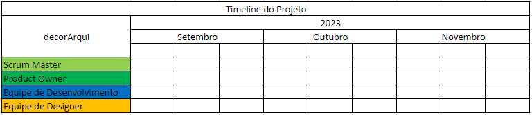

# Especificações do Projeto

Definição do problema e ideia de solução a partir da perspectiva do usuário. É composta pela definição do  diagrama de personas, histórias de usuários, requisitos funcionais e não funcionais além das restrições do projeto.

## Personas

`Carlos Takahara Meirelles`  

Carlos tem 27 anos e é um profissional de arquitetura, ele trabalhava em uma empresa de arquitetura mas decidiu trabalhar por conta própria para realizar o seu sonho de ser um arquiteto de sucesso, ele começou a divulgar o seu serviço em algumas redes sociais, com tempo começaram a aparecer alguns serviços mas não muitos, Carlos busca alguma plataforma/app mais focada na prestação de serviços, com o app decorArqui o número de serviços dele crescerá, por ser um app focado na parte da arquitetura onde ele vai conseguir apresentar os seus projetos e combinar diretamente com os clientes interessados. 

`Marina Gonçalves da Silva`  

Marina tem 34 anos e está se mudando para outra cidade por causa do seu emprego, ela pretende montar um projeto para uma nova casa com ideias sustentáveis e ecológicas para começar sua vida no novo local, por isso ela procura uma plataforma focada em projetos arquitetônicos e principalmente ideias ecológicas para o projeto. 

`Hamilton Andrade Ribeiro` 

Hamilton tem 43 anos e está se divorciando, ele pretende buscar um projeto de uma casa para começar uma nova vida, como ele adora passar o tempo em casa, busca um projeto planejado para isso e também para o seu conforto, o app decorArqui pode o ajudar com o projeto personalizado que ele sempre sonhou.  

## Histórias de Usuários

Com base na análise das personas forma identificadas as seguintes histórias de usuários:

|EU COMO...                 | QUERO/PRECISO ...                  |PARA ...                                |
|---------------------------|------------------------------------|----------------------------------------|
|Carlos Takahara Meirelles  | Divulgar o serviço            | Atrair clientes               |
|Marina Gonçalves da Silva  | Encontrar um projeto arquitetônico personalizado      | Se mudar para sua nova moradia e começar o emprego em uma nova cidade  |
|Hamilton Andrade Ribeiro   | Agilidade para escolher um projeto arquitetônico              | Construir sua nova casa e iniciar sua nova vida  |

## Modelagem do Processo de Negócio 

### Análise da Situação Atual

A crescente necessidade de contratar profissionais altamente qualificados para projetos de decoração e design, combinada com o desejo de promover a sustentabilidade e a ecologia em ambientes residenciais e comerciais é a principal razão da criação do DecorArqui. No processo de negócio atual, a maioria do público desconhece de métodos ou aplicações que facilitem o acesso à serviços de design de interiores, portanto, essas pessoas são compelidas à procurar por profissionais por conta própria; muitas vezes, por falta de acesso ou contato, pessoas que querem fazer uma reforma acabam por fazer todo o processo de design e planejamento por conta própria, sem consultar um profissional antes de começar a construir. Apesar de simples, o processo atual é extremamente trabalhoso pois demanda bastante do cliente.

### Descrição Geral da Proposta

Nossa visão para o DecorArqui é desenvolver uma aplicação distribuída que atue como um facilitador para a busca de arquitetos especializados em projetos de reforma residencial e, ao mesmo tempo, como uma plataforma de acesso a lojas que oferecem móveis sustentáveis, ecologicamente responsáveis. Pretendemos apresentar portfólios de arquitetos que possam ser filtrados de diversas maneiras pelos usuários. Além disso, vamos incluir sugestões de móveis e peças que foram usados em alguns dos projetos desses arquitetos, os poderão ser acessados via link para lojas parceiras.

### Processo 1 – Proposta DecorArqui

Este processo descreve o fluxo padrão desde o primeiro acesso do cliente ao site, até o início de sua reforma. O objetivo do DecorArqui não é ser uma plataforma onde clientes possam conversar com arquitetos em tempo real, mas sim uma forma rápida de ver o que os profissionais de arquitetura tem a oferecer e obter seus respectivos contatos. Por causa disso, toda a interação entre cliente e arquiteto é feita fora da camada do DecorArqui.

## Indicadores de Desempenho

|INDICADOR                | OBJETIVO                  | DESCRIÇÃO                         | FONTE DE DADOS            | PERSPECTIVA               |
|-------------------------|---------------------------|-----------------------------------|---------------------------|---------------------------|
|Taxa de Retenção dos Usuários  | Manter as pessoas usando o aplicativo. | Verificamos quantos arquitetos e clientes continuam a usar o aplicativo após o registro inicial. | Analisamos a atividade contínua dos usuários e verificamos quantos deles permanecem ativos. | Fidelização de Usuários |
|Satisfação do Cliente  | Deixar os clientes satisfeitos. | Avaliamos o quão felizes os clientes estão com os serviços oferecidos no aplicativo. | As avaliações e comentários dos clientes. | Feedback do Cliente |                        |
|Eficiência na Comunicação e Orçamento   | Tornar a interação entre arquitetos e clientes mais eficiente. | Avaliamos quão bem o aplicativo facilita a comunicação e o processo de orçamentação, tornando-o mais suave e eficaz.| Observamos o número de projetos e orçamentos concluídos com sucesso no aplicativo. | Foco na Eficácia Operacional. |
| Parcerias de Lojas |Estabelecer parcerias com lojas para expandir os serviços oferecidos pelo aplicativo.  | Este indicador mede a quantidade de novas parcerias firmadas com lojas que agora estão listadas no aplicativo, ampliando as opções para os usuários. |  Registro de novas parcerias e inclusão de lojas no aplicativo.    |  Crescimento de Parcerias. |
| Sustentabilidade Promovida | Promover práticas sustentáveis por meio do aplicativo. | Este indicador avalia o impacto das iniciativas de sustentabilidade promovidas pelo aplicativo, como redução de resíduos ou consumo consciente. |              Monitoramento das ações sustentáveis e feedback dos usuários em relação a essas iniciativas. | Responsabilidade Ambiental. |
| Eficácia de Divulgação | Avaliar a eficácia das estratégias de divulgação do aplicativo. | Este indicador mede o alcance e o impacto das campanhas de marketing e divulgação do aplicativo, incluindo o aumento no número de downloads e registros. | Dados de desempenho de campanhas de marketing e métricas de crescimento de usuários. | Sucesso na Divulgação. |

## Requisitos

As tabelas que se seguem apresentam os requisitos funcionais e não funcionais que detalham o escopo do projeto. Para determinar a prioridade de requisitos, aplicar uma técnica de priorização de requisitos e detalhar como a técnica foi aplicada.
- [Requisitos Funcionais
 (RF)](https://pt.wikipedia.org/wiki/Requisito_funcional):
 correspondem a uma funcionalidade que deve estar presente na
  plataforma (ex: cadastro de usuário).
- [Requisitos Não Funcionais
  (RNF)](https://pt.wikipedia.org/wiki/Requisito_n%C3%A3o_funcional):
  correspondem a uma característica técnica, seja de usabilidade,
  desempenho, confiabilidade, segurança ou outro (ex: suporte a
  dispositivos iOS e Android).

### Requisitos Funcionais

|ID    | Descrição do Requisito  | Prioridade |
|-------|-------------------------|-------|
|RF-01| Permitir que os arquitetos cadastrem seus perfis, incluindo histórico acadêmico, portfólio de projetos e informações profissionais| ALTA | 
|RF-02| Possibilitar o cadastro de clientes, com a inclusão de um resumo do pedido e uma estimativa de preço para seus projetos | ALTA |
|RF-03| Implementar uma funcionalidade que permita que profissionais e clientes iniciem conversas diretas no WhatsApp | ALTA |
|RF-04| Permitir que os arquitetos enviem orçamentos e propostas detalhadas em resposta aos projetos dos clientes | ALTA |
|RF-05| Desenvolver pesquisa que permita aos usuários filtrar por região e tipo de profissional, simplificando a busca por arquitetos  | MÉDIA |
|RF-06| Habilitar clientes a avaliarem os arquitetos, contribuindo para a reputação e qualidade do serviço prestado  | BAIXA |
|RF-07| Permitir que arquitetos avaliem os clientes, promovendo avaliações recíprocas que ajudam na escolha de projetos | MÉDIA |
|RF-08| Dar aos clientes a capacidade de visualizar informações e projetos passados dos arquitetos, oferecendo insights sobre suas habilidades   | MÉDIA |
|RF-09| Oferecer aos clientes a opção de salvar arquitetos como favoritos, tornando mais fácil o acesso rápido aos profissionais preferidos   | BAIXA |
|RF-10| Possibilitar o cadastro de lojas de itens de decoração, permitindo que elas incluam informações sobre produtos, localização e opções de patrocínio   | ALTA |
|RF-11| Implementar diferentes planos de patrocínio para as lojas, garantindo que elas possam aparecer como referência na pesquisa de móveis e outros itens de decoração   | MÉDIA |
|RF-12| Permitir que os usuários visualizem os produtos das lojas patrocinadoras diretamente na plataforma das lojas   | MÉDIA |

### Requisitos não Funcionais

|ID     | Descrição do Requisito  |Prioridade |
|-------|-----------------------|-------|
|RNF-01| O sistema deve ser responsivo para rodar em um dispositivos móvel | ALTA | 
|RNF-02| Deve processar requisições do usuário em no máximo 3s | BAIXA |
|RNF-03| O sistema deve ser acessado pelos sistemas operacionais Windows e IOS | MÉDIA |  
|RNF-04| Garantir que a aplicação seja compatível com uma variedade de navegadores web (Chrome, Edge, Mozila e Firefox) | ALTA |
|RNF-05| Garantir que a aplicação possa integrar-se facilmente com outros sistemas ou serviços, como serviços de pagamento online ou sistemas de mapeamento | MÉDIA | 
|RNF-06| Criar uma interface de usuário intuitiva e de fácil navegação para garantir que os usuários possam utilizar a aplicação com facilidade, independentemente de sua experiência técnica | BAIXA |
|RNF-07| Garantir que os dados dos usuários, como informações de perfil e histórico de projetos, sejam protegidos com medidas de segurança robustas, como criptografia de dados | ALTA |
|RNF-08| Projetar a aplicação de forma modular e com código bem documentado para facilitar a manutenção e atualizações futuras | MÉDIA |

## Restrições

O projeto está restrito pelos itens apresentados na tabela a seguir.

|ID| Restrição                                             |
|--|-------------------------------------------------------|
|01| O projeto deverá ser entregue até 27/11/2023 |
|02| A capacidade de hospedagem e escalabilidade do servidor deve suportar uma popularização acelerada|
|03| Mudanças rápidas na tecnologia podem requerer atualizações constantes do aplicativo  |
|04| A necessidade de cumprir regulamentos de privacidade de dados e outras leis de proteção ao consumidor pode afetar o design e a funcionalidade do aplicativo |

## Diagrama de Casos de Uso

O diagrama de casos de uso utiliza um modelo gráfico e uma tabela com as descrições sucintas dos casos de uso e dos atores. Ele contempla a fronteira do sistema e o detalhamento dos requisitos funcionais com a indicação dos atores, casos de uso e seus relacionamentos. 

# Matriz de Rastreabilidade

A matriz de rastreabilidade é uma ferramenta usada para facilitar a visualização dos relacionamento entre requisitos e outros artefatos ou objetos, permitindo a rastreabilidade entre os requisitos e os objetivos de negócio. 

A matriz deve contemplar todos os elementos relevantes que fazem parte do sistema.

# Gerenciamento de Projeto

### Áreas de Conhecimento

- [ ] Integração
- [ ] Escopo
- [ ] Cronograma (Tempo)
- [ ] Custos
- [ ] Qualidade
- [ ] Recursos
- [ ] Comunicações
- [ ] Riscos
- [ ] Aquisições
- [ ] Partes Interessadas

### Descrição do Projeto

O decorArqui é uma plataforma que visa abordar a necessidade crescente de contratar profissionais qualificados para projetos de decoração e design de forma conveniente e ao mesmo tempo promover a sustentabilidade e a ecologia nos espaços residenciais e comerciais. A plataforma permite que os usuários encontrem especialistas confiáveis online, compartilhando valores de responsabilidade ambiental na concepção de seus projetos.

### Objetivos do Projeto

- Facilitar a contratação de profissionais de decoração e design de forma online.
- Promover a sustentabilidade e a ecologia nos projetos de decoração.
- Conectar clientes a especialistas qualificados.
- Criar ambientes que respeitem o meio ambiente.

### Escopo do Projeto

O escopo do projeto inclui o desenvolvimento da plataforma online decorArqui, onde os usuários podem encontrar e contratar profissionais de decoração e design. Além disso, a plataforma irá incorporar critérios de sustentabilidade e ecologia nos projetos, incentivando práticas responsáveis em design de interiores.

### Cronograma (Tempo)

O cronograma do projeto prevê o lançamento da plataforma dentro de 6 meses a partir da data de início. Isso inclui o desenvolvimento da plataforma, testes, marketing e lançamento oficial.

### Custos

O orçamento do projeto está estimado em $36.750,00, abrangendo desenvolvimento de software, marketing, recursos humanos e operacionais.

### Qualidade

O projeto prioriza a qualidade, garantindo que os profissionais listados na plataforma sejam qualificados e que os projetos promovam a sustentabilidade e a ecologia.

### Recursos

Os recursos necessários incluem uma equipe de desenvolvimento de software, profissionais de marketing, pessoal de suporte ao cliente e especialistas em decoração e design.

### Comunicações

Será estabelecido um plano de comunicação para promover a plataforma aos usuários e fornecedores de serviços.

### Riscos

Os principais riscos incluem a concorrência no mercado, a aquisição de profissionais qualificados e a aceitação do mercado em relação aos critérios de sustentabilidade.

### Aquisições

Poderá ser necessário adquirir serviços de desenvolvimento de software, marketing digital e recursos humanos.

### Partes Interessadas

As partes interessadas incluem fundadores da plataforma, usuários, profissionais de decoração e design, investidores e a comunidade preocupada com a sustentabilidade.

## Gerenciamento de Tempo

| Atividade                   | Início         | Término        | Dias da Tarefa | Predecessores |
|-----------------------------|----------------|----------------|----------------|---------------|
| Pesquisa de Mercado         | 07/08/2023     | 21/08/2023     | 15             | -             |
| Planejamento do Projeto     | 22/08/2023     | 28/08/2023     | 6             | Pesquisa de Mercado  |
| Documentação do Projeto     | 28/08/2023     | 01/10/2023     | 34             | Planejamento do Projeto |
| Desenvolvimento da Plataforma | 10/09/2023     | 19/11/2023     | 70             | Documentação do Projeto |
| Testes e Depuração          | 20/11/2023     | 27/11/2023     | 7             | Desenvolvimento da Plataforma |

## Gerenciamento de Equipe

O gerenciamento adequado de tarefas contribuirá para que o projeto alcance altos níveis de produtividade. Por isso, é fundamental que ocorra a gestão de tarefas e de pessoas, de modo que os times envolvidos no projeto possam ser facilmente gerenciados. 

## Gestão de Orçamento

O processo de determinar o orçamento do projeto é uma tarefa que depende, além dos produtos (saídas) dos processos anteriores do gerenciamento de custos, também de produtos oferecidos por outros processos de gerenciamento, como o escopo e o tempo.
O orçamento do projeto foi avaliado através da estimativa de 330 horas de trabalho totais para a finalização do projeto. 

|Recurso Necessário| Valor em Dinheiro |
|--|-------------------------------------------------------|
|Recursos Humanos| R$ 23.700,00 |
|Hardware| R$ 12.000,00        |
|Rede| R$ 1.050,00 |
|Custos Totais| R$ 36.750,00|
