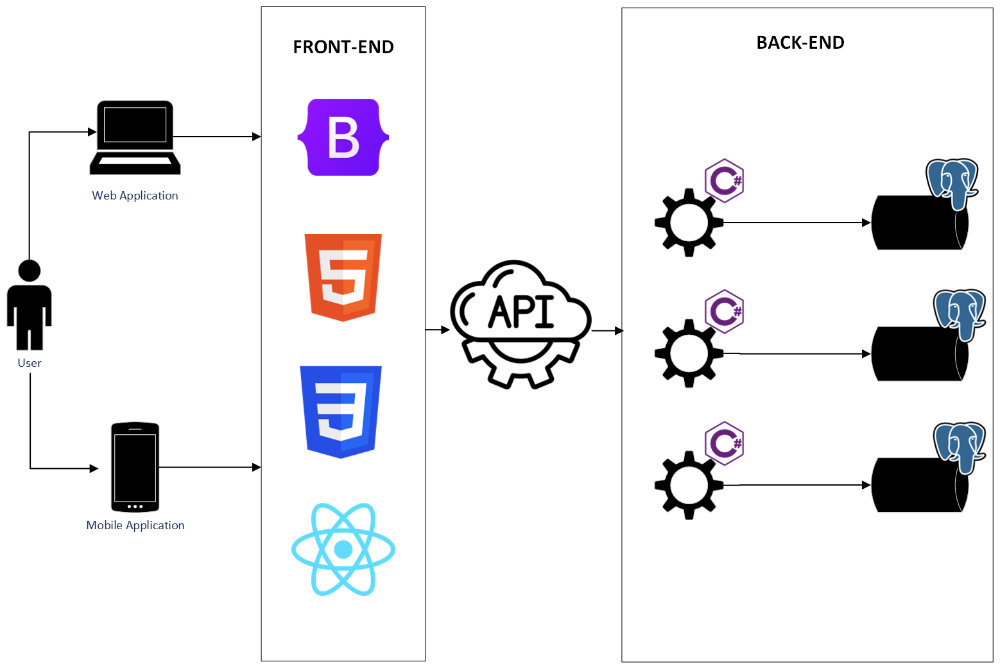

# Arquitetura da Solução

Pré-requisitos: <a href="3-Projeto de Interface.md"> Projeto de Interface</a>

Definição de como o software é estruturado em termos dos componentes que fazem parte da solução e do ambiente de hospedagem da aplicação.

## Diagrama de Classes

O diagrama de classes ilustra graficamente como será a estrutura do software, e como cada uma das classes da sua estrutura estarão interligadas. Essas classes servem de modelo para materializar os objetos que executarão na memória.

As referências abaixo irão auxiliá-lo na geração do artefato “Diagrama de Classes”.

> - [Diagramas de Classes - Documentação da IBM](https://www.ibm.com/docs/pt-br/rational-soft-arch/9.6.1?topic=diagrams-class)
> - [O que é um diagrama de classe UML? | Lucidchart](https://www.lucidchart.com/pages/pt/o-que-e-diagrama-de-classe-uml)

## Modelo ER

O Modelo ER representa através de um diagrama como as entidades (coisas, objetos) se relacionam entre si na aplicação interativa.]

## Esquema Relacional

O Esquema Relacional corresponde à representação dos dados em tabelas juntamente com as restrições de integridade e chave primária.

> - [Criando um modelo relacional - Documentação da IBM](https://www.ibm.com/docs/pt-br/cognos-analytics/10.2.2?topic=designer-creating-relational-model)

## Modelo Físico

Entregar um arquivo banco.sql contendo os scripts de criação das tabelas do banco de dados. Este arquivo deverá ser incluído dentro da pasta src\bd.

## Tecnologias Utilizadas

Descreva aqui qual(is) tecnologias você vai usar para resolver o seu problema, ou seja, implementar a sua solução. Liste todas as tecnologias envolvidas, linguagens a serem utilizadas, serviços web, frameworks, bibliotecas, IDEs de desenvolvimento, e ferramentas.

Apresente também uma figura explicando como as tecnologias estão relacionadas ou como uma interação do usuário com o sistema vai ser conduzida, por onde ela passa até retornar uma resposta ao usuário.

## Hospedagem

Explique como a hospedagem e o lançamento da plataforma foi feita.

> **Links Úteis**:
>
> - [Website com GitHub Pages](https://pages.github.com/)
> - [Programação colaborativa com Repl.it](https://repl.it/)
> - [Getting Started with Heroku](https://devcenter.heroku.com/start)
> - [Publicando Seu Site No Heroku](http://pythonclub.com.br/publicando-seu-hello-world-no-heroku.html)

## Qualidade de Software

A ISO/IEC 25010 é uma norma que sucede a ISO/IEC 9126 e apresenta um modelo atualizado para a qualidade de produto de software. Para um produto de software relacionado à arquitetura, como o DecorArqui, foram selecionadas algumas das subcaracterísticas de maior importância para a saúde do produto:

### Usabilidade
Dado que o DecorArqui busca oferecer uma experiência de usuário moderna e de fácil utilização, a intuitividade e a usabilidade, medidas pelas sub-características abaixo e validadas por meio de testes de usabilidade, desempenharão um papel fundamental no sucesso do projeto.

**Aprendizibilidade**: Grau em que um sistema pode ser usado por usuários para atingir objetivos específicos de aprender a usar o sistema com eficácia, eficiência, livre de riscos e satisfação em um contexto de uso.

**Operabilidade**: Grau em que um produto ou sistema possui atributos que facilitam sua operação e controle.

**Estética da interface do usuário**: Grau em que uma interface do usuário permite uma interação agradável e satisfatória para o usuário.

### Eficiência de Desempenho
O projeto DecorArqui propõe a criação de uma plataforma por onde pessoas em busca de um projeto de arquitetura ou design de interiores serão conectadas com profissionais qualificados, dessa forma a aplicação deverá ser capaz de hospedar vários usuários simultâneos e uma grande quantidade de portifólios de arquitetos.

**Capacidade**: Representa o grau em que os limites máximos do sistema atendem aos requisitos.

### Manutenibilidade
A nível de desenvolvimento e integração contínua, o projeto DecorArqui, usará de tecnologias e padrões de codificação que promovem as sub-características abaixo. O objetivo é alcançar uma aplicação de baixo acoplamento e alta coesão

**Reusabilidade**: Grau em que um recurso pode ser usado em mais de um sistema ou na construção de outros recursos.

**Modificabilidade**: Grau em que um sistema pode ser modificado de forma eficaz e eficiente sem introduzir defeitos ou degradar a qualidade do produto existente.

**Modularidade**: Grau em que um sistema é composto de componentes discretos, de modo que uma alteração em um componente tenha impacto mínimo em outros componentes.
